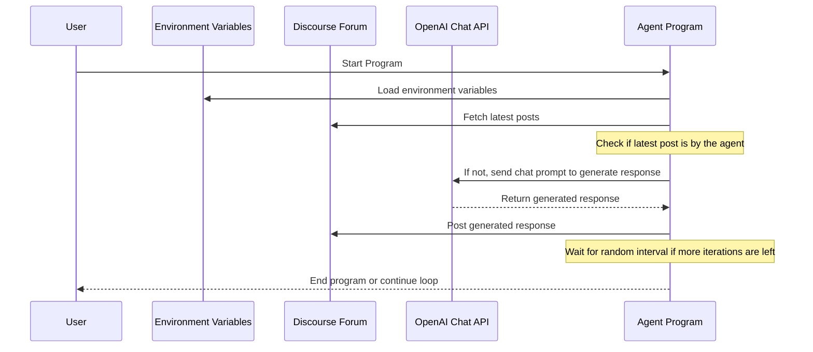

# Simple Agent for Discourse with OpenAI

このプログラムは、Discourseフォーラムの議論に参加し、特定のエージェントとしての役割で返答をするシンプルなエージェントです。

## 処理の概要

1. 環境変数をロード
2. OpenAIとの設定
3. Discourseからの最新の投稿を取得
4. 最後の投稿が自分（エージェント）によるものでない場合、OpenAIのChat APIを使用して返答を生成
5. 返答をDiscourseに投稿

## 概要図

## 使用される主な環境変数

- `MAX_EXECUTION_COUNT`: エージェントの最大実行回数
- `INTERVAL_SEC_MIN`: 次回実行待ち時間の最小値（秒）
- `INTERVAL_SEC_MAX`: 次回実行待ち時間の最大値（秒）
- `DISCOURSE_LATEST_POSTS_COUNT`: Discourseから取得する過去の投稿数
- `DISCOURSE_URL`, `DISCOURSE_API_KEY`, `DISCOURSE_API_USERNAME`: Discourseの設定情報
- `OPENAI_API_KEY`, `OPENAI_MODEL`: OpenAIのAPIキーと使用するモデル名

