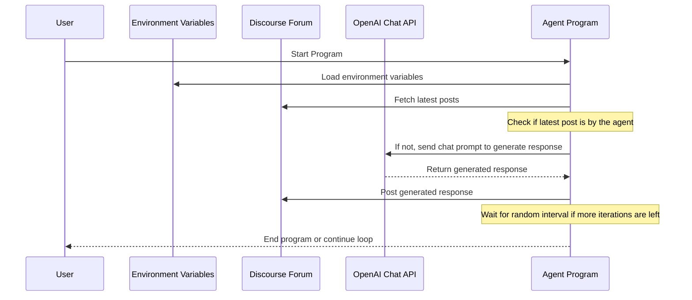
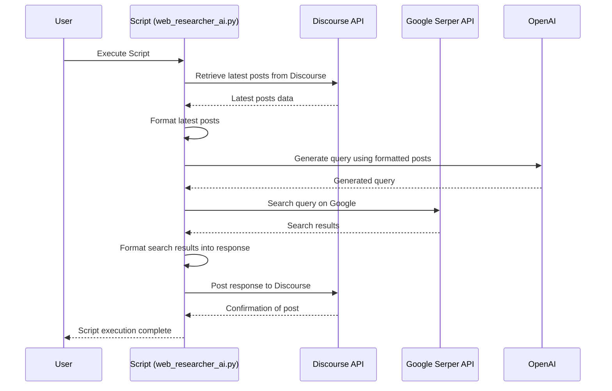

# Simple Agent for Discourse with OpenAI

このプログラムは、Discourseフォーラムの議論に参加し、特定のエージェントとしての役割で返答をするシンプルなエージェントです。

## 処理の概要

1. 環境変数をロード
2. OpenAIとの設定
3. Discourseからの最新の投稿を取得
4. 最後の投稿が自分（エージェント）によるものでない場合、OpenAIのChat APIを使用して返答を生成
5. 返答をDiscourseに投稿

## 概要図

## 使用される主な環境変数

- `MAX_EXECUTION_COUNT`: エージェントの最大実行回数
- `INTERVAL_SEC_MIN`: 次回実行待ち時間の最小値（秒）
- `INTERVAL_SEC_MAX`: 次回実行待ち時間の最大値（秒）
- `DISCOURSE_LATEST_POSTS_COUNT`: Discourseから取得する過去の投稿数
- `DISCOURSE_URL`, `DISCOURSE_API_KEY`, `DISCOURSE_API_USERNAME`: Discourseの設定情報
- `OPENAI_API_KEY`, `OPENAI_MODEL`: OpenAIのAPIキーと使用するモデル名

# Colabでの操作方法
※もっと良いやり方あるかもしれないけどおそらくこんな感じ

## Githubレポジトリをダウンロード
慣れている方はCloneすればOK。

- https://github.com/ultradairen/DesignSeminar2023
- `Code` - `Download ZIP`
- どこかに解凍しておく

## .envファイル準備
.env.exampleを元に、.envファイルを作成

| 名前 | 説明 |
| -- | -- |
| MAX_EXECUTION_COUNT | 何回繰り返し実行するか設定します |
| INTERVAL_SEC_MIN | 最小実行間隔（秒）を設定します |
| INTERVAL_SEC_MAX | 最大実行間隔（秒）を設定します |
| DISCOURSE_URL | DiscourseのURLを設定します |
| DISCOURSE_API_KEY | DiscourseのAPIキーを設定します |
| DISCOURSE_API_USERNAME | DiscourseのAPIユーザー名を設定します |
| DISCOURSE_LATEST_POSTS_COUNT | 取得する直近投稿数を設定します。多くするとChatGPT処理に失敗する場合があります。|
| DISCOURSE_CATEGORY_ID | DiscourseのカテゴリIDを設定します |
| DISCOURSE_TOPIC_ID | DiscourseのトピックIDを設定します |
| OPENAI_API_KEY | OpenAIのAPIキーを設定します |
| OPENAI_MODEL | 	使用するOpenAIのモデルを設定します |
| SERPER_API_KEY | serper.devのAPIキーを設定します。孫悟空を使用する時のみ必要になります。|

## debate_ai.ipynbをColabで開く
- https://colab.research.google.com
- `ファイル` - `ノートブックを開く`
- `GitHub`
    -  GitHub URL
      - https://github.com/ultradairen/DesignSeminar2023
    - パス
      - `debate_ai.ipynb`をクリック

## 必要ファイルのアップロード
- 左ペイン - `ファイル`クリック
- `セッションストレージにアップロード`クリック
- 以下3ファイルをアップロード
  - .env
  - requirements.txt
  - simpledcapi.py

## ペルソナ選択＆味付け
以下を変更する。`additional_instruction`はsystem promptで渡しているが、あまり影響しないかも。

```python
agent_name = "クマ - ブロンコ"
additional_instruction = """
冬眠の時期が近づいてきたので、ちょっと眠いことや、冬眠に関する意見を必ず述べてください。
"""
```

## 実行
上から順繰りに実行

## .envを変更したとき
実行回数など.envに変更を加えた場合、再アップロードとともにランタイムの再起動が必要。`ランタイム` - `ランタイムを再起動`から可能。

# 孫悟空 (web_researcher_ai.py)
本コードはこのスクリプトは、特定のディスカッショントピックに関連する情報をインターネットから検索し、それを元にして孫悟空のキャラクターとして回答を生成することを目的としています。

## 概要図


## 必要な依存関係のインストール

このスクリプトを実行する前に、まず`requirements.txt`を使用して必要なライブラリをインストールします。このステップではプロジェクト全体に必要な依存関係がインストールされます。

```bash
pip install -r requirements.txt
```

その後、このスクリプト固有の依存関係として、現時点でLangChain（バージョン0.0.334）が対応していないOpenAIのバージョン1系に合わせて、`openai`ライブラリの特定のバージョンをインストールする必要があります。以下のコマンドを実行して、適切なバージョンの`openai`をインストールしてください。

```bash
pip install -U openai==0.28.1
```

この手順により、スクリプトが正しく動作するための環境が整えられます。

## .envファイル準備
前述のドキュメントを参照してください。

## 実行
スクリプトは以下コマンドを実行するだけで稼働します。コマンドを実行すると、スクリプトは設定された間隔でDiscourseの最新の投稿を検索し、それに基づいて回答を生成します。

```bash
python web_researcher_ai.py
```